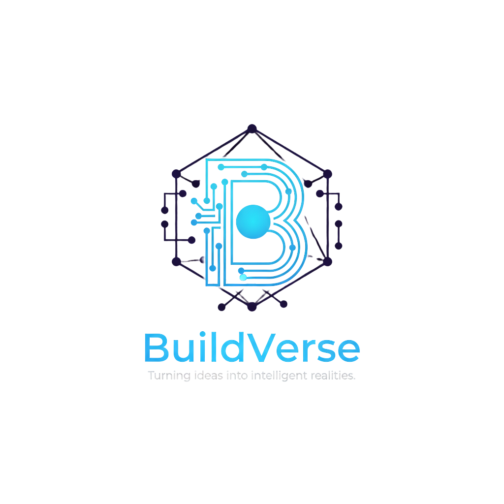

# BuildVerse - AI Innovation Studio

### Turning Ideas Into Intelligent Realities

**Enterprise AI Solutions | MVP Development | AI Voice Agents | Intelligent Automation**

[Website](https://buildverse.ai) • [Contact Us](mailto:hello@buildverse.ai) • [LinkedIn](https://linkedin.com/company/buildverse) • [Twitter](https://twitter.com/buildverse)

---

## 🚀 About BuildVerse

BuildVerse is a cutting-edge **AI innovation studio** dedicated to transforming businesses through artificial intelligence. We specialize in developing enterprise-grade AI solutions that drive innovation, optimize operations, and create lasting competitive advantages.

Founded in 2019, we've partnered with **50+ enterprise clients** across Technology, Finance, Healthcare, Retail, and Manufacturing industries, deploying over **100+ AI models** with a **99% client retention rate**.

### Our Mission

To democratize enterprise AI by making advanced artificial intelligence accessible, practical, and transformative for businesses of all sizes. We believe in creating AI solutions that augment human capabilities, drive efficiency, and unlock new opportunities for growth.

---

## 💼 Our Services

### 🎯 MVP Development & Rapid Prototyping
Transform your vision into market-ready products with AI-driven architecture and rapid prototyping. We help startups and enterprises validate ideas quickly and efficiently.

**Key Features:**
- AI-Powered Architecture
- Rapid Time-to-Market
- Scalable Infrastructure
- Technical Validation

### 🎤 AI Voice & Conversational Agents
Deploy intelligent conversational AI that automates customer interactions with natural language processing and understanding.

**Key Features:**
- Natural Language Processing
- Multi-language Support
- Context-Aware Responses
- 24/7 Automation

### ⚙️ Intelligent Automation & Workflows
Streamline operations with AI-powered automation that learns and adapts to your business processes, reducing manual work by up to 70%.

**Key Features:**
- Process Optimization
- Smart Decision Making
- Predictive Analytics
- Seamless Integration

### 🛠️ Custom AI Solutions & Consulting
Tailored AI implementations designed to solve your unique business challenges with cutting-edge machine learning and deep learning technologies.

**Key Features:**
- Custom Model Development
- AI Strategy Consulting
- Technology Assessment
- Implementation Support

---

## 📊 Our Track Record

| Metric | Achievement |
|--------|-------------|
| **Years of Excellence** | 5+ Years |
| **AI Models Deployed** | 100+ |
| **Enterprise Clients** | 50+ |
| **Client Retention** | 99% |
| **Industries Served** | 5+ |
| **Global Reach** | Worldwide |

---

## 🏆 Why Choose BuildVerse?

### ✨ Enterprise-Grade Solutions
- Production-ready AI implementations
- Scalable architecture from pilot to full deployment
- Security and compliance built-in
- 24/7 monitoring and support

### 🚀 Proven Methodology
- Agile development process
- Rapid prototyping and iteration
- Continuous improvement
- ROI-focused approach

### 👥 Expert Team
- AI/ML specialists with 10+ years experience
- Full-stack developers
- UX/UI designers
- DevOps engineers

### 🔒 Security First
- Enterprise-grade security
- Data privacy compliance
- Regular security audits
- ISO 27001 ready

---

## 🌟 Industry Expertise

We serve clients across multiple industries:

- **Technology** - SaaS platforms, DevOps automation
- **Finance** - Fraud detection, risk assessment
- **Healthcare** - Patient care automation, diagnostics
- **Retail** - Customer personalization, inventory optimization
- **Manufacturing** - Quality control, predictive maintenance

---

## 💡 Technology Stack

Our solutions are built with cutting-edge technologies:

**AI/ML Frameworks:**
- TensorFlow & PyTorch
- Scikit-learn & XGBoost
- Hugging Face Transformers
- OpenAI GPT & LLaMA

**Backend:**
- Python, Node.js
- FastAPI, Express
- PostgreSQL, MongoDB
- Redis, Elasticsearch

**Frontend:**
- React, Next.js
- TailwindCSS
- TypeScript
- Framer Motion

**Infrastructure:**
- AWS, Google Cloud, Azure
- Docker, Kubernetes
- CI/CD with GitHub Actions
- Monitoring with Prometheus

---

## 📞 Get In Touch

We'd love to hear about your project and discuss how AI can transform your business.

### Contact Information

- 📧 **Email:** hello@buildverse.ai
- 📱 **Phone:** +1 (234) 567-8900
- 🌐 **Website:** [buildverse.ai](https://buildverse.ai)
- 💼 **LinkedIn:** [linkedin.com/company/buildverse](https://linkedin.com/company/buildverse)
- 🐦 **Twitter:** [@buildverse](https://twitter.com/buildverse)

### Business Hours

- **Monday - Friday:** 9:00 AM - 6:00 PM EST
- **Saturday:** 10:00 AM - 2:00 PM EST
- **Sunday:** Closed

---

## 🎯 Case Studies

### Retail AI Recommendation System
**Client:** Major E-commerce Platform  
**Challenge:** Improve product recommendations  
**Solution:** Custom ML model with collaborative filtering  
**Results:** 35% increase in conversion rate

### Healthcare Diagnostic Assistant
**Client:** Regional Healthcare Network  
**Challenge:** Reduce diagnostic time  
**Solution:** Computer vision AI for medical imaging  
**Results:** 50% faster diagnosis, 99% accuracy

### Financial Fraud Detection
**Client:** FinTech Startup  
**Challenge:** Real-time fraud detection  
**Solution:** Deep learning anomaly detection  
**Results:** 90% reduction in fraud cases

---

## 🚀 Our Process

### 1. **Discovery & Strategy**
- Understanding your business goals
- Identifying AI opportunities
- Technology assessment
- ROI projection

### 2. **Design & Prototyping**
- Solution architecture
- Rapid prototyping
- User experience design
- Stakeholder feedback

### 3. **Development & Training**
- AI model development
- Backend/frontend integration
- Model training & optimization
- Quality assurance

### 4. **Deployment & Support**
- Production deployment
- Performance monitoring
- Continuous optimization
- 24/7 support

---

## 🌐 Global Presence

BuildVerse serves clients worldwide with a focus on:

- **North America** - Primary market
- **Europe** - Growing presence
- **Asia-Pacific** - Strategic partnerships
- **Middle East** - Emerging markets

---

## 📈 Client Success Stories

> *"BuildVerse transformed our customer service operations with their AI voice agent. We've seen a 40% reduction in support costs while improving customer satisfaction."*  
> — **CTO, Tech Startup**

> *"The MVP they developed helped us secure Series A funding. Their technical expertise and business acumen were invaluable."*  
> — **CEO, FinTech Company**

> *"Working with BuildVerse was seamless. They understood our healthcare compliance needs and delivered a HIPAA-compliant AI solution."*  
> — **Director, Healthcare Organization**

---

## 🎓 Thought Leadership

Stay updated with our insights on AI innovation:

- 📝 **Blog:** AI trends, best practices, case studies
- 🎤 **Webinars:** Monthly AI implementation workshops
- 📚 **Whitepapers:** In-depth technical guides
- 🎙️ **Podcast:** Interviews with AI leaders

---

## 🤝 Partnership Opportunities

We're always looking to collaborate with:

- **Technology Partners** - Integration and co-development
- **Consulting Firms** - AI advisory services
- **Startups** - Accelerator and incubator programs
- **Enterprises** - Strategic AI transformation

**Interested in partnering?** Email us at partnerships@buildverse.ai

---

## 💼 Careers

Join our team of AI innovators! We're hiring:

- AI/ML Engineers
- Full-Stack Developers
- DevOps Engineers
- Product Managers
- Business Development

**View open positions:** careers@buildverse.ai

---

## 🔐 Security & Compliance

BuildVerse takes security seriously:

- ✅ **SOC 2 Type II** (In Progress)
- ✅ **ISO 27001** Ready
- ✅ **GDPR** Compliant
- ✅ **HIPAA** Compliant (Healthcare projects)
- ✅ **Regular Security Audits**
- ✅ **Data Encryption** (At rest & in transit)

---

## 📄 Legal

- [Terms of Service](https://buildverse.ai/terms)
- [Privacy Policy](https://buildverse.ai/privacy)
- [Cookie Policy](https://buildverse.ai/cookies)
- [Data Processing Agreement](https://buildverse.ai/dpa)

---

## 🌟 Recognition & Awards

- 🏆 **AI Startup of the Year 2024** - Tech Innovation Awards
- 🥇 **Best AI Implementation** - Enterprise Tech Summit
- ⭐ **Top 10 AI Companies to Watch** - TechCrunch
- 🎖️ **Innovation Excellence Award** - AI Business Forum

---

## 📱 Follow Us

Stay connected for updates, insights, and AI news:

---

## 🚀 Ready to Get Started?

Transform your business with AI. Let's build something amazing together.

**[Schedule a Consultation](https://buildverse.ai/contact)** | **[View Our Services](https://buildverse.ai/#services)** | **[See Our Work](https://buildverse.ai/#portfolio)**

---

### BuildVerse - Turning Ideas Into Intelligent Realities

**© 2025 BuildVerse AI Studio. All rights reserved.**

*Empowering businesses with cutting-edge artificial intelligence solutions.*

Made with ❤️ by the BuildVerse Team

[Website](https://buildverse.ai) • [Contact](mailto:hello@buildverse.ai) • [LinkedIn](https://linkedin.com/company/buildverse) • [Twitter](https://twitter.com/buildverse)

